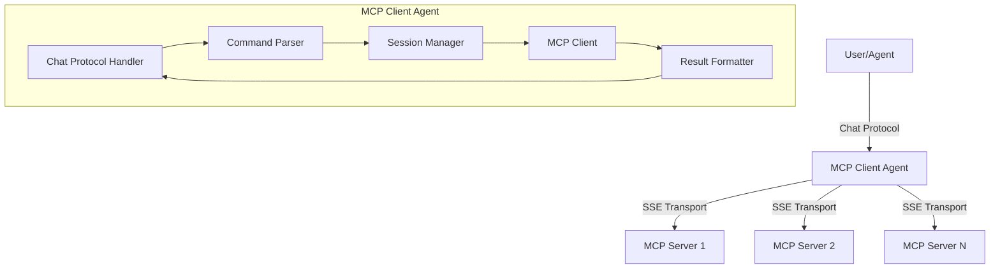

# MCP Client Agent Plan

## Overview

The MCP Client Agent will be a uagents-based agent that:
1. Connects to any MCP server via SSE transport
2. Provides a chat interface for interacting with MCP servers
3. Uses structured commands (e.g., `!connect`, `!call`) for clear interaction
4. Maintains state between messages to remember server connections

## Architecture



## Components

### 1. Agent Core
- Main agent class that initializes the uagents framework
- Includes the chat protocol
- Handles startup and shutdown

### 2. Chat Protocol Handler
- Processes incoming chat messages
- Extracts commands from messages
- Sends responses back to users

### 3. Command Parser
- Parses structured commands from chat messages
- Validates command syntax
- Extracts parameters

### 4. Session Manager
- Maintains connection state with MCP servers
- Handles connection/disconnection
- Stores active sessions

### 5. MCP Client
- Wraps the fastmcp Client class
- Handles communication with MCP servers
- Manages tool calls and responses

### 6. Result Formatter
- Formats MCP responses into readable chat messages
- Handles different result types (text, JSON, etc.)

## Supported Commands

The agent will support the following structured commands:

1. `!connect [url] [--token TOKEN] [--token-env-var VAR_NAME]`
   - Connects to an MCP server at the specified URL
   - Optional token for authentication
   - Optional environment variable name for token

2. `!disconnect`
   - Disconnects from the current MCP server

3. `!list`
   - Lists available tools on the connected MCP server

4. `!call [tool_name] [json_args]`
   - Calls a tool with JSON arguments
   - Example: `!call search_models {"query": "stable-diffusion"}`

5. `!shorthand [tool_name] [arg1=value1] [arg2=value2] ...`
   - Shorthand syntax for calling tools
   - Example: `!shorthand search_models query="stable-diffusion"`

6. `!status`
   - Shows current connection status

7. `!help`
   - Shows available commands and usage examples

## Implementation Plan

### Step 1: Project Setup
1. Create the asi_mcp directory structure
2. Create requirements.txt with necessary dependencies
3. Create a README.md with usage instructions

### Step 2: Core Agent Implementation
1. Implement the main agent class
2. Set up chat protocol integration
3. Implement basic message handling

### Step 3: Command Parsing
1. Implement command parser
2. Define command syntax and validation
3. Create help documentation

### Step 4: Session Management
1. Implement session manager
2. Handle connection state
3. Implement connection/disconnection logic

### Step 5: MCP Client Integration
1. Integrate fastmcp Client
2. Implement tool listing and calling
3. Handle responses and errors

### Step 6: Result Formatting
1. Implement result formatter
2. Handle different result types
3. Create readable chat responses

### Step 7: Testing and Documentation
1. Test with various MCP servers
2. Document usage examples
3. Create sample scripts

## File Structure

```
asi_mcp/
├── README.md                  # Usage documentation
├── requirements.txt           # Dependencies
├── agent.py                   # Main agent entry point
├── chat_handler.py            # Chat protocol handler
├── command_parser.py          # Command parsing logic
├── session_manager.py         # MCP session management
├── mcp_client.py              # MCP client wrapper
├── result_formatter.py        # Result formatting utilities
└── examples/                  # Example scripts
    ├── simple_client.py       # Simple chat client example
    └── weather_example.py     # Example using weather MCP server
```

## Dependencies

```
uagents>=0.6.0
uagents-core>=0.2.0
fastmcp>=0.1.0
pydantic>=2.0.0
aiohttp>=3.8.5
python-dotenv>=1.0.0
```

## Implementation Details

### agent.py
- Main agent class with chat protocol integration
- Command routing and response handling
- Startup and shutdown logic

### chat_handler.py
- Process incoming chat messages
- Extract commands and parameters
- Format and send responses

### command_parser.py
- Parse structured commands
- Validate syntax and parameters
- Extract arguments for MCP calls

### session_manager.py
- Maintain connection state
- Handle connection/disconnection
- Store active sessions

### mcp_client.py
- Wrap fastmcp Client
- Handle tool listing and calling
- Process responses

### result_formatter.py
- Format MCP responses for chat
- Handle different result types
- Create readable output